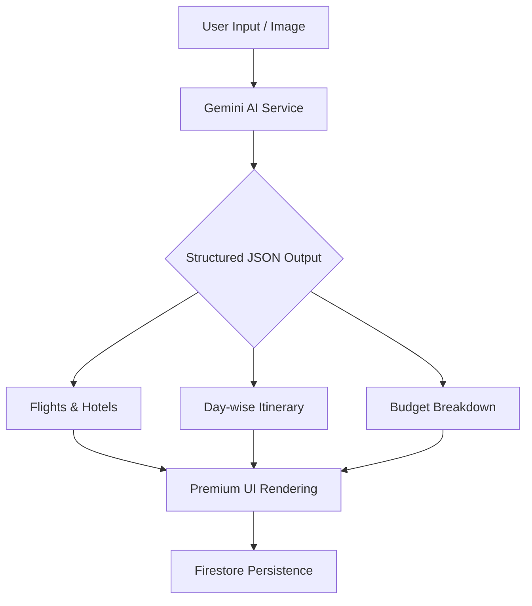

# Trip For Me 🌍✈️


### Your Autonomous AI Travel Concierge
Trip For Me is a state-of-the-art, AI-powered travel agent that transforms a single prompt into a complete, personalized, and bookable journey in seconds. Leveraging the reasoning power of Google's **Gemini 1.5 Flash**, it automates hours of research into a seamless, high-velocity workflow.

---

## ✨ Features

- **🚀 Instant Itinerary Generation**: Day-by-day plans, optimized for timing and feasibility.
- **🏨 Intelligent Recommendations**: Curated flights, hotels, and transit options.
- **💰 Budget Forecasting**: Real-time cost estimates categorized by category.
- **📸 Multimodal Input**: Upload an image of a destination to get a tailored plan.
- **🔒 Secure User Profiles**: Save your favorite journeys and access them anywhere with Firebase Authentication.
- **⚡ Ultra-Refined UI**: A premium, glassmorphic interface built with Framer Motion and Tailwind CSS.
- **🗺️ Actionable Links**: Integrated booking links for flights and hotels.

---

## 📸 App Interface


---

## 🛠️ Tech Stack

| Category | Technology |
| :--- | :--- |
| **Frontend** | React 19, TypeScript, Vite |
| **Styling** | Tailwind CSS, Lucide Icons |
| **Animations** | Framer Motion |
| **AI Engine** | Google Gemini 1.5 Flash (@google/genai) |
| **Backend/Auth** | Firebase (Firestore, Auth) |
| **Data Viz** | Recharts |

---

## 🏗️ How it Works



---

## 🚀 Getting Started

### 1. Prerequisites
- Node.js (v18+)
- A Google Cloud API Key (for Gemini)
- A Firebase Project

### 2. Installation
```bash
# Clone the repository
git clone https://github.com/Chetan0e/Trip-For-Me.git

# Navigate to the project
cd Trip-For-Me

# Install dependencies
npm install
```

### 3. Environment Setup
Create a `.env` file in the root directory and add the following:

```env
# Gemini AI
VITE_GEMINI_API_KEY=your_gemini_api_key

# Firebase Configuration
VITE_FIREBASE_API_KEY=your_apiKey
VITE_FIREBASE_AUTH_DOMAIN=your_authDomain
VITE_FIREBASE_PROJECT_ID=your_projectId
VITE_FIREBASE_STORAGE_BUCKET=your_storageBucket
VITE_FIREBASE_MESSAGING_SENDER_ID=your_messagingSenderId
VITE_FIREBASE_APP_ID=your_appId
```

### 4. Launch
```bash
npm run dev
```

---

## 🎯 Our Mission
Travel planning is often fragmented and tedious. **Trip For Me** democratizes access to professional-grade travel planning, giving everyone the confidence to explore the world with clarity and style.

Built with ❤️ by the Trip For Me Team.
